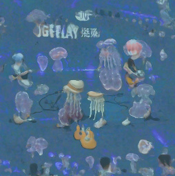

# 简单记录下心路历程（节选）

## 2021/1/17 星期日 17:09:37

xyq不会自称鼠鼠了吧，太哈人了

但是，这样的世界观确实很有感染力很动人呀（？ ）

鼠鼠的话里面，常常渗透着作为底层和屌丝的自卑与对此的自嘲，在“反串”方面，鼠鼠们也积极参加这一有趣的游戏

所以，对某人的无脑信仰也是，在这一模仿过程中以及对真粉丝的视奸之中，他们完成了“典”的传播

但是，虽然xyq并没有参与其中，但还是感受到了信仰某人的虚幻的快感，啊

## 2021/2/16 星期二 01:24:52

大概算是最近感兴趣的v？

毕竟事物在发展阶段还是相当有趣的

不过，这个v还是非常特殊的，例如它是饭圈资本进入B站V市场的证明（虽然目前还没什么动作），又收编了一堆v吧人，最近还引流了一堆不明生物，评论区成分复杂

然而最近由于一系列操作评论区正在争吵中，emm，咱是无法判断谁说的是对的，哪种做法是对的，但是xyq真的疑似有些入脑

咱喜欢嘉然的什么呢？

大概像是优秀的技术加上符合性癖的外表就行了吧，不过然然role play感比较重，也许xyq更喜欢晚指导一些？

## 2021/3/26 星期五 15:14:37

真是绝了，虽然xyq以前想过开发小作文查重网站的可能性，但是这位直接给做出来了啊

而且还有原文（疑似）地址，你做的好啊

## 2021/3/26 星期五 22:16:35

让我们来用deep-daze画“水母正在舞台上弹吉他”~

## 2021/3/29 星期一 20:25:36

如果用网络流行事物的话，这个事物能超过三年吗？

呜呜，我的然然还有多少年呢（

## 2021/4/16 星期五 19:21:37

然然今天吃什么

## 2021/4/22 星期四 23:37:55

没想到是以这种方式又一次听到本兮的歌

说起来我和本兮快一样大了吧

要是她还活着就好了。

但是，为什么《情花》对然然来说是特殊的歌呢？

只是巧合吧。 当年咱第一个喜欢的歌手？ 虽然没什么追星的感觉

现在的她是偶像公司的虚拟组合，这次也没有追星的感觉呢。

## 2021/5/24 星期一 09:37:54

今天做了和然然有关的梦

## 2021/6/4 星期五 15:54:11

现在的偶像也在逐渐向着咱自己的年龄接近吧，甚至已经有很多比咱年纪还小的明星了

所以从小然身上也能看到曾经的一部分自己是吗（

或者是不存在的、自己曾经暗恋的某个女孩

嗯所以这个机会还挺难得的，毕竟等于的条件比大于和小于要苛刻多了，不知道以后都是比自己小的偶像看起来是什么感受（笑）

## 2021/6/12 星期六 10:43:45

昨晚推到3点多，怎么说呢，质量还是比不上优秀商业作品，但是这可是一个月内做出来的同人作品，可以说是很牛了

CG有点奇怪但是关键地方的演出还行，音乐xyq听不懂但是量很足（好多bgm只用1次），有些BGM音量太大了，而且插入的官方作品太突兀，可能统一一下风格会更好？ 3周目的弹幕小游戏很强（一次拿成就啦happy）。 系统在本小作品（？ ）中算是合格（要是快进能更快点就好了）

下面来说下剧情等方面。

前面几章节奏太快，没几句就一章了，而且章节之间的过渡很生硬（比如战斗、日常等），剧情人物的行动逻辑可疑（阿草只是单纯的忘了初心的坏人），世界观设定太刻意（多巴胺.jpg），最主要的是无论是整体剧情、情节片段包括演出都有强烈的既视感，但它们有没有恰当地组合到一起，文本在贝贝珈那里玩高达铁血团长梗真的破坏气氛（

但是本作在三个结局（NE，HE，TE）的章节都表现的不错，节奏紧凑，勉强能够沉浸进去，NE的战斗比较激烈吸引人，教堂环节除了然然奇妙的设定外无论是环境还是人物行动描写都相当有感染力（但是有些东西放的太急了），xyq差点忘记了外面奇怪的世界，TE说实话xyq没有完全看懂，然然为什么你只是看着啊（

全文的问题是表达的主题并不鲜明，是为了表达抗争牺牲与权利？ 为了队友之爱战斗与轮回？ 陪着一个魂走下去？

当然15w的文本的负担很重，在一个月内要是有顶级剧本可是天方夜谭，那些知名作者不也有垃圾作品吗.jpg

## 2021/6/14 星期一 15:53:45

xyq显然并不是只因为模型喜欢上了as，甚至xyq对纸片人的基础好感度还要更高一些，也许xyq最喜欢的还是这个“自由”的粉丝氛围吧，虽然这个氛围是在及其特殊的历史条件下才得到存在和发展的，也带有非常强烈的不稳定因素，随时都可能坍塌，未来的xyq应该是知道as是什么结局的吧。

也许是在某次事故之后就一蹶不振分崩离析，也许是在xyq的某次转型中磨损了对as的感情，也许as在发展到某个程度后就停滞不前，事业粉失去信念，也许能够继续发展成为名副其实的B站第一箱，登上以前的au无法想象的舞台。

当然，也可能是现在的xyq无法想象的其他情况，那时候的as还存在吗？ 是怎么样的呢？

## 2021/6/17 星期四 18:38:31

<https://mew.fun/n/a_soul>

mew社区，相比于贴吧和豆瓣的优点在于和传统论坛不同，帖子和走廊都是动态更新的

（所以xyq以前也从来没有听过这个社区）

## 2021/6/24 星期四 01:55:00

说真的，为什么我们这么喜欢给可爱的女孩子加上寄吧呢？

## 2021/7/1 星期四 11:09:21

想到一个与asoul有关的偶像养成游戏idea

这个游戏的主题可以有很多，比如说让大家认识到asoul的运营中会遇到多少事故、巧合、困难、苦衷啦，看似匪夷所思的决定实际上是怎么样的啦，走不同的路会有什么样的结果啦，某些决定累加在一起到底有多少影响啦，不同论坛（贴吧，豆瓣，NGA，B站等）的对立与联合啦，竞争对手的行动啦（干脆做成联机算了）……

不过这游戏的平衡应该很难做吧。 xyq其实是想要多整几条合理的路线。

除了从企划预热做起以外还有“残局”功能，比如运营刚刚犯了个大病之后什么的

困难除了游戏开发还有“是否符合实际”这点，毕竟一般人看不到全貌

## 2021/7/17 星期六 12:26:41

贝拉万舰也太哈人了

具体来说是11379舰

要知道贝拉本人的粉丝数也只有25.7w人，活粉就更少了

所以AS的氛围是真的很“狂热”啊，不管是动物园、二次元的第一次追星也好，V吧奠定的小作文、发病氛围和独特话术也好，总之AU这个群体确实是某种意义上的“奇迹（中性）”了

昨天的直播有一说一xyq还是看得蛮出脑的，比如台本调用情绪的方式，有点生疏的节目衔接方式，硬凸人设。 包括最后的舞剧，也频繁出现动捕错误，而且这个节目无论是舞蹈（可能是因为动捕无法发挥100%的实力，虽然xyq认为动捕应该加强实力，但可能会被认为是假跳）还是舞台特效都有可以改进的地方，不过作为一个排练不是很长时间而总长达到3小时的表演，也确实很不错了

说起来按照AS的形式能不能实现像是少女歌剧那样的舞台剧呢（虽然从表现上只是把三次元换成了二次元，最多场景能够更方便地表现了）

## 2021/7/18 星期日 22:08:51

\A-SOUL/\A-SOUL/\A-SOUL/

入脑，但没有完全入脑……

## 2021/7/20 星期二 16:16:08

梦见下雨天表白然然

不过对方好像完全没什么反应的样子

## 2021/7/23 星期五 19:16:50

捏麻麻地我要笑死了

## 2021/7/28 星期三 08:23:48

晚晚，你就是个傻逼！！！！！！！！！！！！！！！！！！！！！！！！！！！！！！！！！！！！！！！！！！！！！！！！！！！！！！！！！！！！！！！！！！！！！！！！！！！！！！！！！！！！！！！！！！！！！！！！！！！！！！！！！！！！！！！！！！！！！！！！！！！！！！！！！！！！！！！！

## 2021/7/29 星期四 00:36:07

要是没发生这破事就好了

## 2021/7/29 星期四 16:52:53

不过又一次梦见AS了呢

这次是在异世界的学校，参加as的毕业会，就是她们每个人最后再到操场上给周围的人讲两句的样子

然后一转学习异能，晚指导是学霸

好像没怎么梦到小的，气

## 2021/7/30 星期五 18:43:06

希望……

事实是不重要的，只要是你在意的人，即使是骗你的

## 2021/7/31 星期六 15:48:49

同一个虚拟主播能有多个形象，同时这些形象存在较大的差异：

1. 出道时企划、画师和本人确定的初设定
1. 本人在营业过程中能够感受到的rp目标
1. 观众眼中实际rp出的形象
1. 观众和主播在互动过程中创造的夸张的形象
1. 观众从主播的真情实感中感受到的魂形象
1. 中之人的其他皮形象（前世等）
1. 中之人使用的其他社交网络账号的形象
1. 中之人真人的社会形象
1. 中之人真人的隐私形象

那么这次的事件对前五层形象有什么破坏呢？ 我认为，这主要伤害的是“观众从主播的真情实感中感受到的魂形象”这一层，这也是有人破防有人无感的原因，有的观众在看直播的过程中对那些明显rp出来的设定也报以rp的态度，对他们感受和推理出的魂的形象十分狂热，那么当中之人的形象暴露时，魂的真实形象和幻想形象的冲突就会造成背叛一样的重击。

可能有些观众对魂的要求比较严苛，比如说“她是虚拟的”“她不是人类”，那么这样的观众必然会受到冲击，有些观众的要求就比较宽松了，比如说没有黑点就行，不是自己讨厌的人就行，以及如果是美少女还会加分的。

总之，在观众不管有没有破防总之接受了中之人的形象，并且将她与虚拟形象绑定之后，还会有另外的问题。 观众眼里的虚拟形象开始受到很大的限制：最受限的是“观众眼中的魂的形象”，她不能和中之人的实际形象相冲突，其次是“夸张的二创形象”，因为原始设定的详细必然会影响二创的发散程度

也许理智的看法是皮魂分开，像对待作品一样对待虚拟形象——不管作者做了什么逆天事情，在阅读作品的时候就只评价作品——然而这一点也不完全对，因为结合作者生平分析作品一向是阅读理解的热门方法，而且因为作者的错误移情作品的事情也屡见不鲜。况且，我们都知道像AS这样的形象和中之人的演出是密不可分的。我们会关心中之人的待遇、心理健康，在中之人被替换的时候发出抗议

## 2021/8/6 星期五 22:13:37

确实看别人玩会想玩呀

料理模拟器

不过有点贵

## 2021/8/13 星期五 17:13:04

小然50w粉丝庆祝回！

虽然举办的时候已经80w了

其实台本写得很好，充满了对前50w粉丝时期直播内容的neta，没看首播和小作文回的xyq对有些梗只是有所耳闻，这下引流狗了

然然的歌力依然稍有尴尬，舞力还是那么无敌，不过结尾的不可思议节目是真的做的很棒，很用力去唱了

和生日会相比，纪念回没有什么新场景新衣服新技术，稍微平淡，视频轨迹和小阿草并不喧宾夺主，团播时长也适中，挺开心的

然然可爱捏，加油！！！

虽然并不知道你的真实想法

## 2021/8/30 星期一 10:31:54

想存档asoul录播

虽然但是，比起录播，可能xyq的个人数据更值得记录一些

a手又不是什么糊逼女团，再过个十年互联网上应该还是有资料留存的吧

……应该吧，到时候xyq会不会跑去看其他女团去了

又或者xyq根本活不到十年

不然如果xyq能再活个30年，那么补一补之前的录播也不错

（但是那样不会超级寂寞的吗，看着她们说一起进步，看着她们说去鸟巢，但是那时候的xyq已经知道了a手的命运，知道a手是怎么散的，而且a手已经不会再继续播了）

（从这个方向走的小作文也挺有意思的呀，偶像脱下面具成为凡人的破防效果更是顶中顶）

## 2021/8/30 星期一 10:42:20

昨天看某上古切片的时候晚指导字正腔圆地说了句“贴贴捏”，被可爱到的同时难绷

我还是更喜欢那个疑似早泄的小向晚形象啊（误）

## 2021/8/31 星期二 21:16:15

【嘉然_锤头丧气】

## 2021/9/7 星期二 20:31:28

呵，这无用的BUG

## 2021/9/10 星期五 10:09:24

然然，你一个半小时单播播了个啥啊！！！！

## 2021/9/18 星期六 08:01:05

仅仅是这样就会很好听

在吵闹的环境下给一只耳朵挂上耳机，听某人的歌就会有奇妙的私语的感觉

不过总感觉像是别的什么人的声线，比如说金发公主什么的

## 2021/9/18 星期六 15:10:34

睡了两个小时，应该算是比较沉的那种了

大概是刷bilibili动态不断有坏消息，xyq只记得asoul的珈乐唐突毕业了

不过梦里的世界设定和xyq好像身份也不简单，可惜xyq在醒来的一瞬间忘记了

好在醒来的时候不会发生这种情况，728太难顶了，真不想再经历一次

## 2021/9/23 星期四 20:38:46

水母伞真的好看!!!

（起因是向晚的一张二创图）

## 2021/9/30 星期四 10:57:36

笑死，google和百度搜索力反馈的第一页都能找到asoul

尤其是关联搜索词

这下出圈了

不过也有可能是推送吧

虽然但是，这玩意儿有什么用呢？

看到演示里可以用来让大家轻松体验打开和关闭飞机舱门，做到现实中没钱或者不可能做的事

似乎用来1v1握手也算是非常合适了，不知道哪个公司能偷过去（

## 2021/11/16 星期二 14:28:42

今天听hopeful dreamer比较了下，发现嘉然小姐的声线比起萌妹音似乎还带了些成熟

虽然她唱歌确实……

## 2021/11/25 星期四 09:26:55

晚晚军这个称呼好像也挺可爱的

## 2022/2/15 星期二 17:04:45

原来然然的超能力是引力！

所以可以一定程度上控制时间和空间吗（

## 2022/2/25 星期五 09:29:20

虽然还是安心追玩嘉晚饭双播，但是除了跳舞神中神，唱歌水准没变，游戏菜到昏迷不如不播，两个人互动不是很流畅啊

## 2022/3/28 星期一 17:53:31

有点像然然

这种唱不好的感觉

<https://www.bilibili.com/video/BV1m4411X7vz/?p=28>

## 2022/3/29 星期二 16:50:15

想到一个有趣的插件idea，把所有黑屁然然身高的弹幕（和评论）都找出来，设计一个敏感度的阈值，加上推理模块，实现敏感度最高的时候，产生各种无厘头的理由（要足够多样性这个插件才有用）

弹幕和评论的标记符号可以点击查看理由

这样的插件才有趣啊，面向的领域够小，又和a有密切不可分的联系（真的吗）

名字就从嘉然的呆毛雷达的方向考虑就可以了

如果要求不限制bilibili的话，在其他网页能够手动触发，遍历所有的文字就可以了

在评论区以及视频可以设置为是否自动触发

如果弹幕能修改的话，还可以添加其他修饰的emoji（能实现吗）或者其他符号

## 2022/4/1 星期五 11:03:44

所以xyq看A果然还是因为然然……可爱

## 2022/4/13 星期三 09:35:57

你能理解一个33岁老男人在地铁上快哭出来的感觉吗？ 我一个40岁的嘉心糖抱着马桶吐了两个小时

## 2022/4/13 星期三 09:55:06

虽然大家都是很认真很认真的同辈人，但是也许也会有xy所不能接受的观念呢

……所以还是一辈子也不要出现在xy的视线中为好

都看二次元了，让xy安心看看符合自己期望的包装好的偶像吧呜呜

## 2022/4/14 星期四 09:50:25

<https://stitch-time.github.io>

所以问题就是，这个能力能产出什么作品呢？

让然然一直笑吗（

可以用来对口型……但是这个应该是其他网络更擅长的

可以用来化妆……？

## 2022/4/30 星期六 13:11:28

这绝对是有内鬼有预谋的吧

虽然毕竟经历过一次晚子了有抵抗力了，但是等开到然的时候xyq真的还能顶得住吗……

## 2022/5/1 星期日 13:01:30

这种行为是真的没人管的啊，令人感叹

## 2022/5/8 星期日 20:32:22

然然怎么这么猪鼻啊

今天的团播太可惜了

## 2022/5/9 星期一 06:09:40

果然是然然啊

## 2022/5/9 星期一 07:11:02

那种事情不要啊，728什么的不想再经历一次了

## 2022/5/9 星期一 09:24:42

屏蔽当鸵鸟了，结晶去咯

……当然xyq其实也挺想知道然然以及运营是怎么想的

## 2022/5/9 星期一 10:17:19

试着在Blender里导入然然的模型

## 2022/5/10 星期二 16:46:58

有点想引退了

## 2022/5/11 星期三 17:21:16

若有一天你也离开

会不会偶尔感怀

再看看当时艰难和愉快

再听听那些

夸张的告白

## 2022/5/11 星期三 18:07:47

她们还有好多没有和我们分享，还有好多牌没有出，企划的工商和直播效果都在蒸蒸日上，虽然xyq抗压但是企划最后的弱点也没有了，最开始关注的论坛也是个合格的粉丝论坛了

像看了一场戏剧，一年半的平淡的与坎坷的，最后是终结

## 2022/5/11 星期三 23:41:03

原来我们一直在看这样的鸟儿啊。

## 2022/5/13 星期五 10:44:38

令人感叹

## 2022/5/13 星期五 11:26:45

不觉得很酷吗

## 2022/5/13 星期五 15:57:01

这就是管人痴！

很喜欢墨圣的一句话：管人把娃害了。

## 2022/5/15 星期日 17:56:17

不知道最后的正确记忆会是什么呢。

## 2022/5/18 星期三 15:29:08

恶心得差点吃不下饭

## 2022/5/18 星期三 16:30:28

真是四麦了

草，这个骂人的话好好笑啊

这几天大家疯狂爆典，复读和出牌导致这些典光速传播，属于是榨干一个魂最后的造梗能力了

## 2022/5/18 星期三 16:35:11

失败完全是必然事件阿喵
