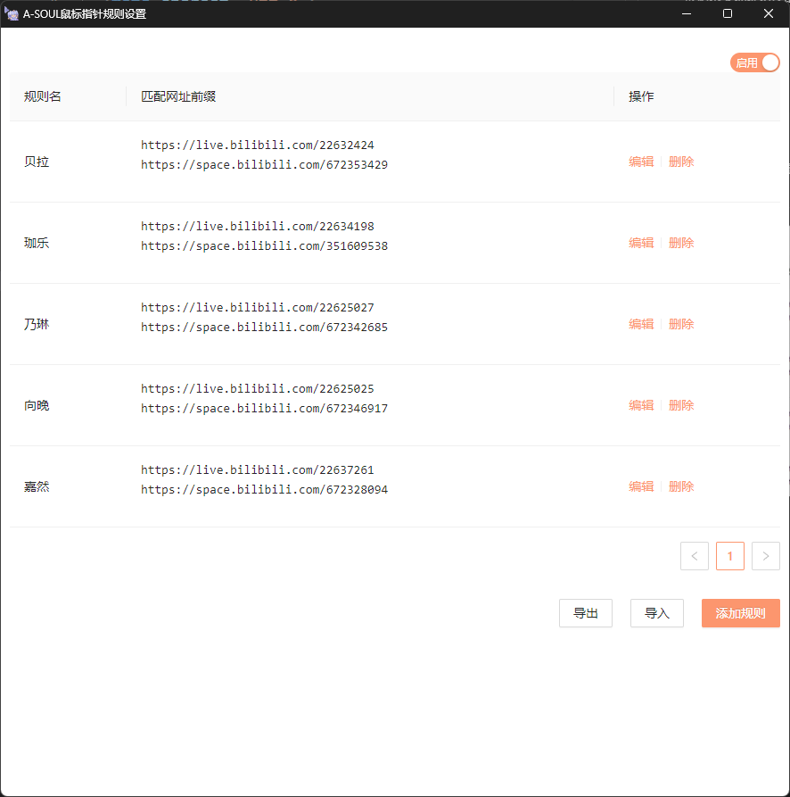
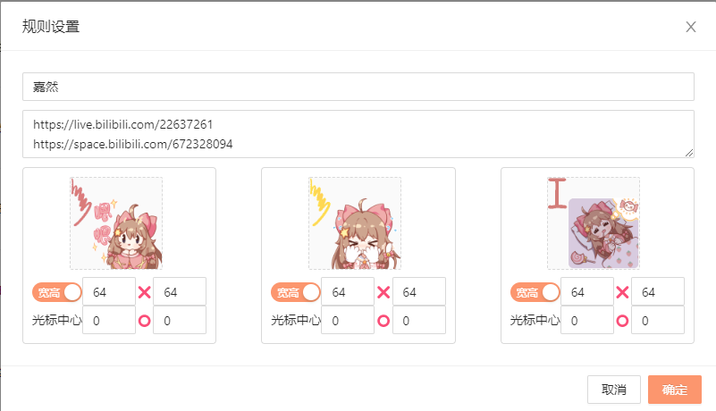

<h1 align="center">
  <br>
  
  <br>
  A-SOUL鼠标指针
  <br>
</h1>

根据网页地址切换鼠标指针的Chrome扩展，鼠标指针与匹配网址可以自行设置。


## 功能介绍

在插件栏单击插件图标，或者在网页空白处右击在菜单中选择`A-SOUL鼠标指针规则设置`，可以弹出设置窗口。

在安装时会自动加载作者制作的默认规则。



下面介绍各个部分的功能

### 启用/禁用

在设置窗口的右上角，可以选择是否启用鼠标指针切换。

### 添加/编辑/删除规则

- 添加规则：单击添加按钮，弹出规则设置窗口。
- 编辑规则：单击编辑按钮，弹出规则设置窗口。
- 删除规则：单击删除按钮，删除规则。



规则设置窗口中，可以设置规则的名称、匹配地址、和图标信息。

- 名称：规则的名称，可以设置为任意字符串。
- 匹配地址：规则的前缀匹配地址，用行分割，结尾不空行。
- 光标信息：在这里可以指定光标在三种状态（默认、超链接，文本编辑）下的图片数据（支持gif，png，jpeg，cur等）、图标的大小（设置宽高或者保留原始大小）、图标中心的位置（x,y）。
- 确认按钮：点击确认按钮后保存并应用规则。

### 导入和导出

将保存的规则（包含光标图片数据）打包为.gz文件，实现不同用户之间的规则共享。

## build

```shell
npm install
npm run build
```

## 项目思路简介

基于TypeScript，前端页面采用Ant Design（Angular）设计，在IndexedDB中保存所有的规则信息。

光标指针的原理是将cursor设置为none，并创建一个img元素跟随鼠标移动。

## 目前的问题

* 在拖动网页内部的scrollbar时，光标不会跟随移动
* 在替换光标时存在光标闪烁现象（比如先显示default和pointer后闪烁消失）
* 在z-index为2147483647的界面可能不会显示

## 计划

* 修复各种bug:)
* 简单化光标制作
* 增强识别功能（根据网页信息推测应该显示什么样的光标）
* 改善光标分享
